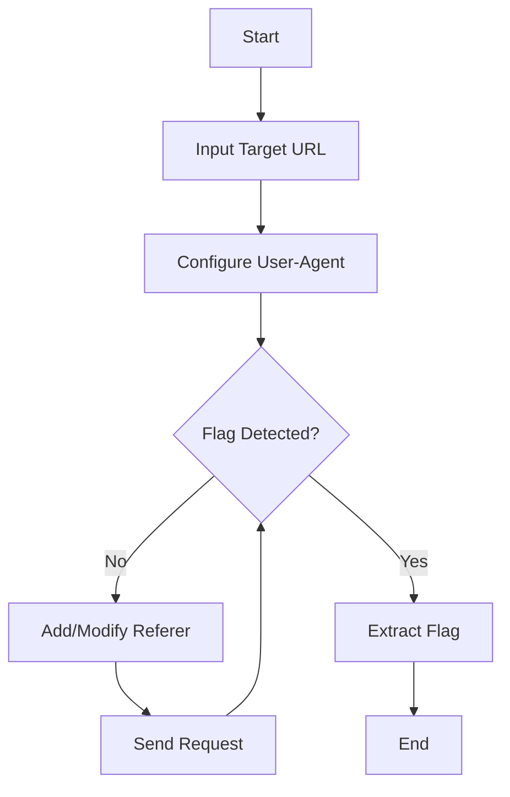

# 🚩 Bypass CTF Tool

## 🔍 Overview
**Bypass CTF Tool** is a sophisticated Python-powered utility designed to help cybersecurity enthusiasts and CTF participants navigate web challenges by intelligently testing various request configurations.

## ✨ Key Features
- 🕵️ **Dynamic User-Agent Spoofing**
  Easily simulate different browser and client environments to bypass access restrictions.

- 🔓 **Flexible Referer Manipulation**
  Precisely control HTTP Referer headers to mimic legitimate web traffic.

- 🖥️ **Real-Time Response Analysis**
  Instant visibility into server responses, enabling quick strategic adjustments.

- 🎯 **Automated Flag Detection**
  Smart algorithm to automatically identify and extract hidden flags.

## 🛠 Installation & Setup In Kali Linux

### Prerequisites
- Python 3 `sudo apt-get install python3 -y`

### Quick Start
```bash
# Clone the repository
git clone https://github.com/Zakvsl/CTF-BypassTool.git

# Navigate to project directory
cd source

# Run the tool
python3 bypassTool.py
```

## 🚀 Usage Guide

1. **Target URL Entry**
   - Input the specific web challenge URL
   - Ensure accuracy of the target endpoint

2. **User-Agent Configuration**
   - Select or input custom User-Agent strings
   - Test various browser and device signatures

3. **Referer Handling**
   - Optional but powerful Referer header injection
   - Useful for bypassing server-side validation


Maybe you guys wondering how can i get the User Agent right?
I got the user agent using inspect the website. When I practice a CTF especially on the web, the first thing I do is inspect the website.

## 📊 Workflow


## 🛡️ Ethical Considerations
- **Educational Purpose Only**
- **Respect CTF Rules & Competition Guidelines**
- **Responsible Usage**

## 🤝 Contribution
Passionate about cybersecurity tools? 
- Fork the repository
- Create feature branches
- Submit pull requests
- Follow our [Contribution Guidelines](CONTRIBUTING.md)

## 📜 License
[MIT License](LICENSE) - Open-source and community-driven

## ⚠️ Disclaimer!!!
This tool is strictly for educational and ethical cybersecurity learning. Misuse is solely the responsibility of the user.
This tool is created for educational and cybersecurity purposes only. 
Unauthorized use is the sole responsibility of the user.
This project has been tested using challenges from the CTFLearn platform. All testing was conducted ethically and in accordance with the platform's rules and guidelines.

## Additional Information!!
- I also made a file to show how I solved the CTF challenge manually using curl on [Tutorial](TUTORIAL.md)
---

**🔐 Happy Ethical Hacking!**
